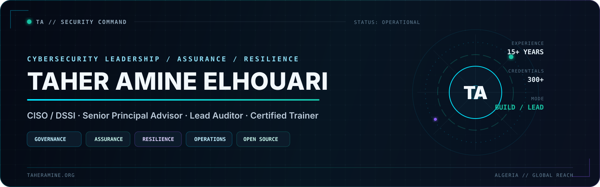

<p align="center">
  <a href="https://taheramine.org">
    
  </a>
</p>

<p align="center">
  <a href="https://taheramine.org"></a>
  <a href="https://taheramine.org/services.html"></a>
  <a href="https://github.com/MrTaherAmine/release-sentry"></a>
  <a href="https://www.linkedin.com/in/MrTaherAmine/"></a>
</p>

<div align="center">

### CISO / DSSI · Senior Principal Advisor · Multi-Accredited Lead Auditor · Certified GOLD Trainer

<sub><strong>Governance · GRC · Audit & Assurance · SOC / CSIRT · Cloud Security · Cyber Resilience · Training</strong></sub>

<br><br>

<code>STRATEGY</code> · <code>ASSURANCE</code> · <code>RESILIENCE</code> · <code>OPERATIONS</code> · <code>OPEN SOURCE</code>

</div>

---

## `01 / mission-control`

I work where **cybersecurity, governance, assurance, operations, and leadership** meet.

I help organizations turn standards, risk, technology, and executive decisions into security
programs that are **measurable, resilient, auditable, and usable in the real world**—not
security theatre and not compliance for its own sake.

```text
taher@cyber:~$ ./profile --executive

ROLE       CISO / DSSI · Senior Principal Advisor
MISSION    Make security governable, defensible and operational
RANGE      Advisory · Audit · Training · Community · Open Source
EXPERIENCE 15+ years across IT and cybersecurity
STATUS     OPEN_TO_SERIOUS_ENGAGEMENTS
```

> **Most organizations do not have a security problem.  
> They have a governance problem that manifests as security.**

---

## `02 / operating-system`

<table>
<tr>
<td width="25%" valign="top">
<h3>01 · Govern</h3>
<p><strong>Strategy & GRC</strong></p>
<p>Security governance, enterprise risk, ISMS/BCMS/PIMS, operating models, executive reporting, compliance, maturity roadmaps and vCISO leadership.</p>
</td>
<td width="25%" valign="top">
<h3>02 · Defend</h3>
<p><strong>SOC, CSIRT & resilience</strong></p>
<p>SOC/CSIRT strategy, incident response, crisis management, threat intelligence, SIEM/SOAR, VAPT, DFIR and red/purple teaming.</p>
</td>
<td width="25%" valign="top">
<h3>03 · Assure</h3>
<p><strong>Audit & certification</strong></p>
<p>Security assurance, accredited audits, certification readiness, control assessments, framework mapping and evidence-driven improvement.</p>
</td>
<td width="25%" valign="top">
<h3>04 · Enable</h3>
<p><strong>Training & capability</strong></p>
<p>Certification training, executive awareness, workshops, mentoring, tabletop exercises and practitioner-focused capacity building.</p>
</td>
</tr>
</table>

<p align="center">
  <a href="https://taheramine.org/services.html"><strong>Explore professional services and engagements →</strong></a>
</p>

---

## `03 / flagship-build`

<table>
<tr>
<td width="68%" valign="top">
<h2>🛡️ Release Sentry</h2>
<p><strong>Inspect release artifacts before they become security incidents.</strong></p>
<p>A production-ready, local-first defensive CLI that scans software release packages before publication or deployment. It detects exposed secrets, hostile archive structures, sensitive files, unsafe permissions, missing production assets, broken static-site references and policy violations.</p>
<p><strong>Private by design:</strong> no uploads, no telemetry, no blind extraction and no execution of artifact content.</p>
<p>
<a href="https://github.com/MrTaherAmine/release-sentry"><strong>Explore the repository →</strong></a><br>
<a href="https://github.com/MrTaherAmine/release-sentry/releases/latest"><strong>Download the latest release →</strong></a>
</p>
</td>
<td width="32%" valign="top">
<h3>Release profile</h3>
<p><strong>Version</strong><br><code>v1.0.1</code></p>
<p><strong>Runtime</strong><br><code>Python 3.11+</code></p>
<p><strong>Test coverage</strong><br><code>100%</code></p>
<p><strong>License</strong><br><code>MIT</code></p>
<p><strong>Operating model</strong><br><code>Local · Offline · Read-only</code></p>
</td>
</tr>
</table>

<p align="center">
  <a href="https://github.com/MrTaherAmine/release-sentry/releases/latest"></a>
  
  
  <a href="https://github.com/MrTaherAmine/release-sentry/blob/main/LICENSE"></a>
  
</p>

---

## `04 / knowledge-and-media`

<table>
<tr>
<td width="50%" valign="top">
<h3>🧠 Cyber Master Series</h3>
<p>A growing professional knowledge ecosystem connecting <strong>learning, certification and applied cybersecurity practice</strong>.</p>
<p><code>Study Guides</code> · <code>Professional Books</code> · <code>Practitioner Toolkits</code></p>
<p><a href="https://taheramine.org/cyber-master-series/"><strong>Explore the ecosystem →</strong></a></p>
</td>
<td width="50%" valign="top">
<h3>🎓 Certification Study Series</h3>
<p>Free community editions built from official objectives, authoritative sources and practical context.</p>
<p><code>Interactive Editions</code> · <code>PDF Guides</code> · <code>Versioned Releases</code></p>
<p><a href="https://taheramine.org/cyber-master-series/certification-guides/"><strong>Browse the guides →</strong></a></p>
</td>
</tr>
<tr>
<td width="50%" valign="top">
<h3>🎙️ The InfoSec Control Room</h3>
<p>A podcast about the decisions behind security programs: governance, ownership, risk, controls, operations and resilience.</p>
<p><a href="https://taheramine.org/podcast.html"><strong>Enter the Control Room →</strong></a></p>
</td>
<td width="50%" valign="top">
<h3>🌍 TaherAmine.org</h3>
<p>My professional command center for advisory, audit, training, speaking, research, media, projects and selected work.</p>
<p><a href="https://taheramine.org"><strong>Visit the professional portfolio →</strong></a></p>
</td>
</tr>
</table>

---

## `05 / open-source-index`

| Project | Mission | Access |
|---|---|---|
| **🛡️ Release Sentry** | Local-first security scanner for release artifacts, archives, secrets, permissions and policy violations. | [Repository →](https://github.com/MrTaherAmine/release-sentry) |
| **🧠 Cyber Master Series — Certification Guides** | Free professional certification guides, interactive editions, PDFs and governed releases. | [Repository →](https://github.com/MrTaherAmine/cyber-master-series-certification-guides) |
| **🎤 Conferences** | Slides, workshops and materials from selected talks and technical sessions. | [Repository →](https://github.com/MrTaherAmine/Conferences) |
| **🔬 CVE-2018-10583** | Security research and proof-of-concept work for an information-disclosure vulnerability. | [Repository →](https://github.com/MrTaherAmine/CVE-2018-10583) |
| **🔐 Strong Password Generator** | Lightweight Python utility for generating strong passwords. | [Repository →](https://github.com/MrTaherAmine/Strong-Password-Generator) |

<p align="center">
  <a href="https://github.com/MrTaherAmine?tab=repositories"><strong>Explore the complete repository portfolio →</strong></a>
</p>

---

## `06 / capability-map`

<table>
<tr>
<td width="50%" valign="top">
<h3>Govern & assure</h3>
<p><code>ISO/IEC 27001</code> <code>ISO/IEC 27002</code> <code>ISO/IEC 27005</code> <code>ISO 22301</code> <code>ISO/IEC 27701</code> <code>ISO/IEC 42001</code> <code>NIST CSF</code> <code>NIST SP 800-53</code> <code>CIS Controls</code> <code>PCI DSS</code> <code>SWIFT CSP</code> <code>SOC 2</code></p>
</td>
<td width="50%" valign="top">
<h3>Defend & respond</h3>
<p><code>SOC</code> <code>CSIRT</code> <code>Incident Response</code> <code>DFIR</code> <code>Threat Intelligence</code> <code>SIEM/SOAR</code> <code>VAPT</code> <code>Red Team</code> <code>Purple Team</code> <code>Crisis Management</code></p>
</td>
</tr>
<tr>
<td width="50%" valign="top">
<h3>Cloud & technology</h3>
<p><code>ISO/IEC 27017</code> <code>ISO/IEC 27018</code> <code>CSA CCM / STAR</code> <code>Cloud Assurance</code> <code>IEC 62443</code> <code>OWASP</code> <code>Secure Architecture</code> <code>AI Governance</code></p>
</td>
<td width="50%" valign="top">
<h3>Lead & enable</h3>
<p><code>vCISO</code> <code>Executive Advisory</code> <code>Accredited Audit</code> <code>Certification Training</code> <code>Tabletop Exercises</code> <code>Mentoring</code> <code>Community Leadership</code></p>
</td>
</tr>
</table>

---

## `07 / proof-of-work`

<div align="center">

| **15+** | **300+** | **4** | **50+** | **3** | **Top 10** |
|:---:|:---:|:---:|:---:|:---:|:---:|
| Years in IT & Cyber | Certifications & Credentials | Continents | Training Programs | Chapters Founded | International CTF Finishes |

</div>

### Selected professional contribution

- **Global Advisory Board** — EC-Council C\|CISO and C\|PENT
- **Subject Matter Expert / Contributor** — ISC2, Hack The Box and AfricaCERT
- **Community leadership** — founding leadership with OWASP Algiers, CSA Algeria and CAS Algeria
- **International knowledge sharing** — speaker, trainer, mentor and program committee contributor
- **Recognition** — Global 30 Under 30 in Cybersecurity 2026; Best Cybersecurity Thought Leader — Governance, Risk & Resilience, UK 2026

---

## `08 / current-signal`

```yaml
building:
  - Security tools that solve real practitioner problems
  - Cyber Master Series
  - Professional cybersecurity books
  - Practitioner toolkits

publishing:
  - Free certification study guides
  - Applied cybersecurity resources
  - Research and conference material

broadcasting:
  - The InfoSec Control Room

open_to:
  - Executive cybersecurity advisory
  - Accredited audit and assurance engagements
  - Training, speaking and strategic collaboration
```

---

## `09 / connect`

<div align="center">

### Build something meaningful.

If you are working on cybersecurity governance, GRC, security assurance, SOC/CSIRT,
resilience, cloud security, professional training, research or open-source security,
I am always interested in serious conversations and useful collaboration.

<br>

<a href="https://taheramine.org"></a>
<a href="https://taheramine.org/services.html"></a>
<a href="https://www.linkedin.com/in/MrTaherAmine/"></a>
<a href="mailto:contact@taheramine.org"></a>
<a href="https://taheramine.org/podcast.html"></a>

<br><br>

<sub><strong>Learn it. Certify it. Apply it. Master it.</strong></sub>

<br><br>

<sub>© 2000–2026 Taher Amine ELHOUARI · Built with purpose for the global cybersecurity community.</sub>

</div>


