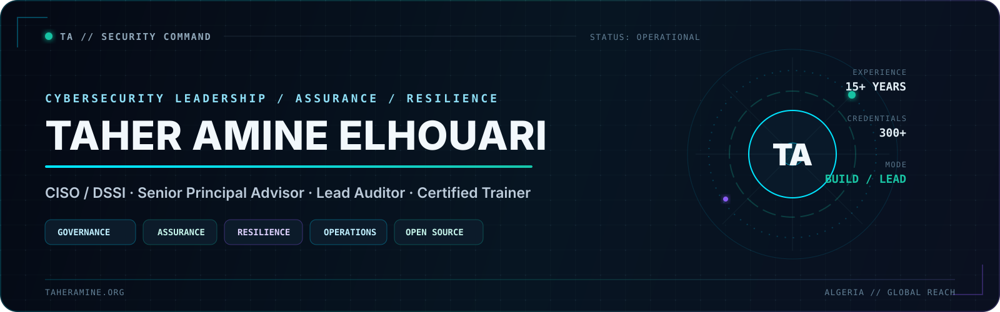

<p align="center">
  <a href="https://taheramine.org">
    
  </a>
</p>

<p align="center">
  <a href="https://taheramine.org"></a>
  <a href="https://taheramine.org/services.html"></a>
  <a href="https://github.com/MrTaherAmine/release-sentry"></a>
  <a href="https://www.linkedin.com/in/MrTaherAmine/"></a>
  <a href="https://taheramine.org/podcast.html"></a>
</p>

<p align="center">
  <a href="#mission"><strong>MISSION</strong></a>
  &nbsp;·&nbsp;
  <a href="#capabilities"><strong>CAPABILITIES</strong></a>
  &nbsp;·&nbsp;
  <a href="#release-sentry"><strong>FLAGSHIP BUILD</strong></a>
  &nbsp;·&nbsp;
  <a href="#ecosystem"><strong>ECOSYSTEM</strong></a>
  &nbsp;·&nbsp;
  <a href="#proof"><strong>PROOF</strong></a>
  &nbsp;·&nbsp;
  <a href="#connect"><strong>CONNECT</strong></a>
</p>

<br>

<div align="center">

| **STATUS** | **PRIMARY MODE** | **BASE** | **REACH** |
|:---:|:---:|:---:|:---:|
| `OPEN TO ENGAGEMENTS` | `BUILD · LEAD · ASSURE` | `ALGERIA` | `GLOBAL` |

</div>

---

<a id="mission"></a>

## `01 // mission`

### I make cybersecurity governable, defensible and operational.

I work where **cybersecurity, governance, assurance, operations and leadership** meet. I help
organizations convert standards, risk, technology and executive intent into security programs
that are **measurable, resilient, auditable and usable in the real world**.

```text
taher@cyber:~$ ./mission --brief

INPUT      Risk · Complexity · Regulation · Operational reality
METHOD     Govern · Defend · Assure · Enable
OUTPUT     Security programs that survive audits and incidents
STANDARD   Evidence over theatre
```

> **Most organizations do not have a security problem.  
> They have a governance problem that manifests as security.**

---

<a id="capabilities"></a>

## `02 // capability-deck`

<table>
<tr>
<td width="25%" valign="top">
<h3>◈ GOVERN</h3>
<p><strong>Strategy · GRC · vCISO</strong></p>
<p>Security governance, enterprise risk, ISMS/BCMS/PIMS, operating models, executive reporting, compliance and maturity roadmaps.</p>
</td>
<td width="25%" valign="top">
<h3>◈ DEFEND</h3>
<p><strong>SOC · CSIRT · Resilience</strong></p>
<p>Security operations, incident response, crisis management, threat intelligence, SIEM/SOAR, DFIR, VAPT and red/purple teaming.</p>
</td>
<td width="25%" valign="top">
<h3>◈ ASSURE</h3>
<p><strong>Audit · Controls · Certification</strong></p>
<p>Accredited audits, security assurance, certification readiness, control assessments, framework mapping and evidence-led improvement.</p>
</td>
<td width="25%" valign="top">
<h3>◈ ENABLE</h3>
<p><strong>Training · Exercises · Mentoring</strong></p>
<p>Certification training, executive awareness, practitioner workshops, tabletop exercises, mentoring and capacity building.</p>
</td>
</tr>
</table>

<p align="center">
  <a href="https://taheramine.org/services.html"><strong>Explore professional services and engagements →</strong></a>
</p>

---

<a id="release-sentry"></a>

## `03 // flagship-build`

<table>
<tr>
<td width="66%" valign="top">
<h2>🛡️ Release Sentry</h2>
<p><strong>Inspect release artifacts before they become security incidents.</strong></p>
<p>Release Sentry is a production-ready, local-first defensive CLI that scans release packages before publication or deployment.</p>
<p>It detects exposed secrets, hostile archive structures, sensitive files, unsafe permissions, missing production assets, broken static-site references and policy violations.</p>
<p><strong>Trust model:</strong> local · offline · read-only · no telemetry · no blind extraction · no artifact execution.</p>
</td>
<td width="34%" valign="top">
<h3>RELEASE TELEMETRY</h3>
<table>
<tr><td><strong>Version</strong></td><td><code>1.0.1</code></td></tr>
<tr><td><strong>Coverage</strong></td><td><code>100%</code></td></tr>
<tr><td><strong>Runtime</strong></td><td><code>Python 3.11+</code></td></tr>
<tr><td><strong>License</strong></td><td><code>MIT</code></td></tr>
<tr><td><strong>Mode</strong></td><td><code>Local-first</code></td></tr>
</table>
</td>
</tr>
</table>

<p align="center">
  <a href="https://github.com/MrTaherAmine/release-sentry"></a>
  <a href="https://github.com/MrTaherAmine/release-sentry/releases/latest"></a>
  <a href="https://github.com/MrTaherAmine/release-sentry/blob/main/README.md"></a>
</p>

---

<a id="ecosystem"></a>

## `04 // ecosystem`

<table>
<tr>
<td width="33.33%" valign="top">
<h3>🧠 Cyber Master Series</h3>
<p>A professional knowledge ecosystem connecting learning, certification and applied cybersecurity practice.</p>
<p><code>Study Guides</code><br><code>Professional Books</code><br><code>Practitioner Toolkits</code></p>
<p><a href="https://taheramine.org/cyber-master-series/"><strong>Explore →</strong></a></p>
</td>
<td width="33.33%" valign="top">
<h3>🎓 Certification Study Series</h3>
<p>Free community editions built from official objectives, authoritative references and practical context.</p>
<p><code>Interactive Editions</code><br><code>Downloadable PDFs</code><br><code>Versioned Releases</code></p>
<p><a href="https://taheramine.org/cyber-master-series/certification-guides/"><strong>Browse →</strong></a></p>
</td>
<td width="33.33%" valign="top">
<h3>🎙️ The InfoSec Control Room</h3>
<p>A podcast about the decisions behind security programs—governance, ownership, risk, controls, operations and resilience.</p>
<p><code>Leadership</code><br><code>Applied Security</code><br><code>Real Decisions</code></p>
<p><a href="https://taheramine.org/podcast.html"><strong>Listen →</strong></a></p>
</td>
</tr>
</table>

---

<a id="proof"></a>

## `05 // proof-of-work`

<div align="center">

| **15+** | **300+** | **4** | **50+** | **3** | **Top 10** |
|:---:|:---:|:---:|:---:|:---:|:---:|
| Years in IT & Cyber | Certifications & Credentials | Continents | Training Programs | Chapters Founded | International CTF Finishes |

</div>

<table>
<tr>
<td width="50%" valign="top">
<h3>Authority & contribution</h3>
<ul>
<li><strong>Global Advisory Board</strong> — EC-Council C|CISO and C|PENT</li>
<li><strong>Subject Matter Expert / Contributor</strong> — ISC2, Hack The Box and AfricaCERT</li>
<li><strong>Community leadership</strong> — OWASP Algiers, CSA Algeria and CAS Algeria</li>
<li><strong>Knowledge sharing</strong> — international speaker, trainer, mentor and program committee contributor</li>
</ul>
</td>
<td width="50%" valign="top">
<h3>Recognition</h3>
<ul>
<li><strong>Global 30 Under 30 in Cybersecurity</strong> — 2026</li>
<li><strong>Best Cybersecurity Thought Leader</strong> — Governance, Risk & Resilience, UK 2026</li>
<li><strong>International CTF performance</strong> — multiple Top 10 finishes</li>
<li><strong>Professional reach</strong> — advisory, audit and training across four continents</li>
</ul>
</td>
</tr>
</table>

---

## `06 // selected-open-source`

| Project | Mission | Access |
|---|---|---|
| **🛡️ Release Sentry** | Defensive release-artifact inspection before publication or deployment. | [Repository →](https://github.com/MrTaherAmine/release-sentry) |
| **🧠 Cyber Master Series Guides** | Free professional certification guides and governed community releases. | [Repository →](https://github.com/MrTaherAmine/cyber-master-series-certification-guides) |
| **🎤 Conferences** | Selected presentation, workshop and technical-session materials. | [Repository →](https://github.com/MrTaherAmine/Conferences) |
| **🔬 CVE-2018-10583** | Vulnerability research and proof-of-concept work. | [Repository →](https://github.com/MrTaherAmine/CVE-2018-10583) |
| **🔐 Strong Password Generator** | Lightweight Python password-generation utility. | [Repository →](https://github.com/MrTaherAmine/Strong-Password-Generator) |

<p align="center">
  <a href="https://github.com/MrTaherAmine?tab=repositories"><strong>Enter the complete repository portfolio →</strong></a>
</p>

---

## `07 // capability-matrix`

<details>
<summary><strong>Governance, assurance and standards</strong></summary>
<br>

`ISO/IEC 27001` · `ISO/IEC 27002` · `ISO/IEC 27005` · `ISO 22301` ·
`ISO/IEC 27701` · `ISO/IEC 42001` · `NIST CSF` · `NIST SP 800-53` ·
`CIS Controls` · `PCI DSS` · `SWIFT CSP` · `SOC 2` · `RNSI`

</details>

<details>
<summary><strong>Security operations, response and resilience</strong></summary>
<br>

`SOC` · `CSIRT` · `Incident Response` · `DFIR` · `Threat Intelligence` ·
`SIEM/SOAR` · `VAPT` · `Red Team` · `Purple Team` · `Crisis Management`

</details>

<details>
<summary><strong>Cloud, technology and emerging security</strong></summary>
<br>

`ISO/IEC 27017` · `ISO/IEC 27018` · `CSA CCM / STAR` · `Cloud Assurance` ·
`IEC 62443` · `OWASP` · `Secure Architecture` · `AI Governance`

</details>

---

## `08 // live-signal`

```yaml
building:
  - Security tools that solve real practitioner problems
  - Cyber Master Series
  - Professional cybersecurity books and toolkits

publishing:
  - Free certification study guides
  - Applied cybersecurity resources
  - Research and conference material

broadcasting:
  - The InfoSec Control Room

open_to:
  - Executive cybersecurity advisory
  - Accredited audit and assurance engagements
  - Training, speaking and strategic collaboration
```

---

<a id="connect"></a>

## `09 // secure-channel`

<div align="center">

### Let us build something meaningful.

Serious conversations are welcome across cybersecurity governance, GRC, assurance, SOC/CSIRT,
resilience, cloud security, professional training, research and open-source security.

<br>

<a href="https://taheramine.org"></a>
<a href="https://taheramine.org/services.html"></a>
<a href="https://www.linkedin.com/in/MrTaherAmine/"></a>
<a href="mailto:contact@taheramine.org"></a>

<br><br>

<sub><strong>LEARN IT · CERTIFY IT · APPLY IT · MASTER IT</strong></sub>

<br><br>

<sub>© 2000–2026 Taher Amine ELHOUARI · Built with purpose for the global cybersecurity community.</sub>

</div>


